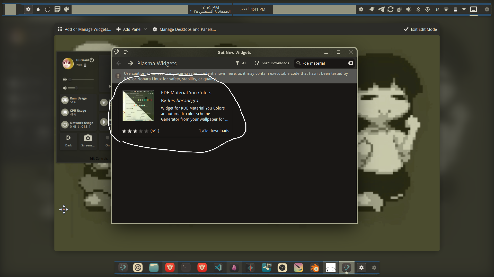
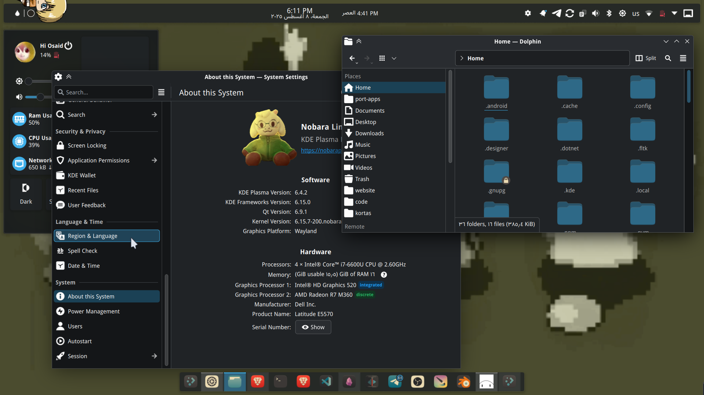
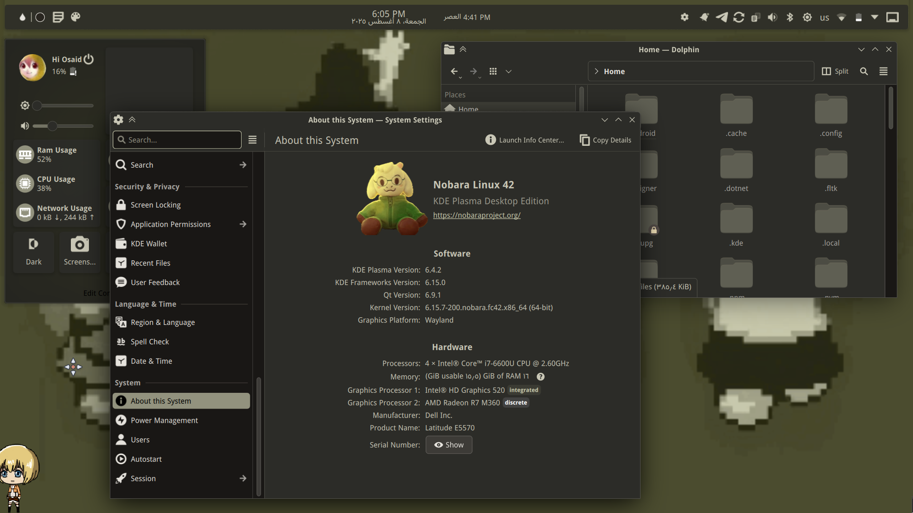
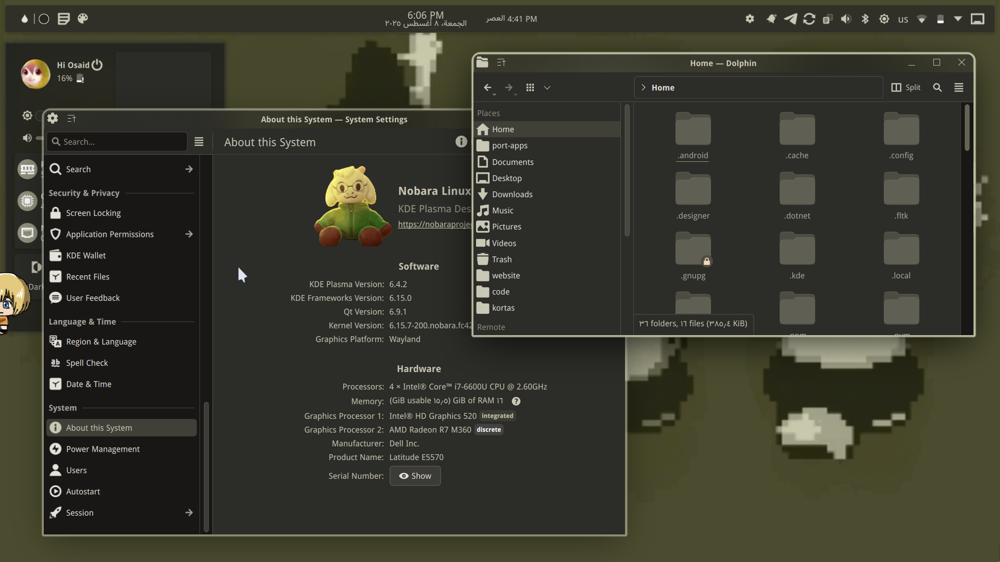
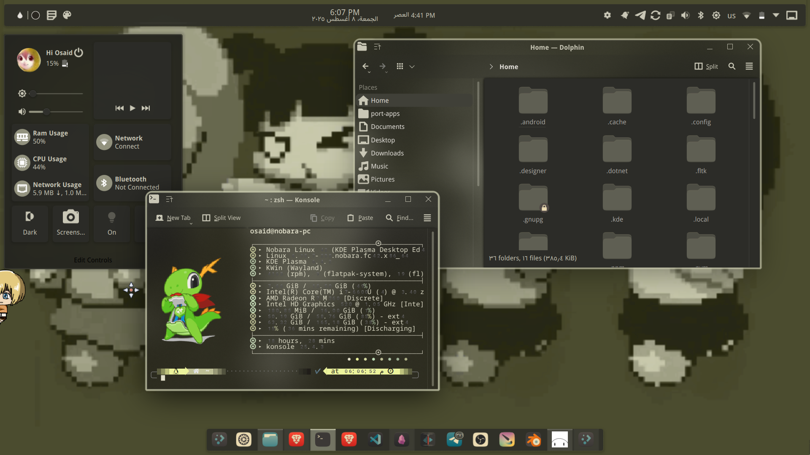

# مقدمة
سطح مكتب **KDE** من الأقوى في عالم لينيكس من حيث الجمع بين السهولة والتخصيص تستطيع تغيير أي شيء وكل شيء من دون حتى أن تلمس **config file**  واحد ومن دون أي برامج طرف ثالث. وفي مقالتنا اليوم سنتكلم عن أفضل أدوات التخصيص التي ستخرج القوة الكامنة لسطح مكتبك وإمكانيات تخصيصه

# [KDE MaterialYouColors](https://github.com/luisbocanegra/kde-material-you-colors)
عبارة عن برنامج طرفية  عمل من خلال **pywal** يقوم بتغيير ألوان النظام وألوان طرفية **KDE konsole** بناء على خلفية سطح المكتب من خلال بناء ملف **color scheme** في تكوينات النظام وتحديثه مع كل مرة يتم تغيير الخلفية.

>مع أن البرنامج يعمل في الطرفية بشكل أساسي إلا أن المطور قام بتوفير واجهة رسومية كwidget يمكنك وضعها في البانل والتحكم بإعدادات البرنامج من خلالها بدلا من الطرفية.

يمكنك تحميل الويدجيت مباشرة من متجر كيدي ووضعها في البانلز

# [Klassy](https://github.com/paulmcauley/klassy)
عبارة عن ثيم تخطيط نوافذ **(window decoration)** يحمل العديد من الخيارات والإعدادات القليل من الأمثلة عليها:
1. إضافة خط ملون حول النوافذ والتحكم بحجمه ولونه وشفافيته في النوافذ النشطة وغير النشطة.
2. إضافة ظلال حول النوافذ والتحكم بلونها وحجمها.
3. التحكم بحدة حواف النوافذ.
4. التحكم بكل ما يتعلق ب**title bar** كشكل أزرار النوافذ وطريقة تفاعلها وحجمها.
 وغيرها الكثير. باختصار يسمح لك بالتحكم بأي شيء متعلق بالtitle bar والإطار الخارجي للنافذة بشكل كامل.

# [Darkly](https://github.com/Bali10050/Darkly)
وهو عبارة عن **fork** أو نسخة من مشروع سابق يدعى **lightly** يقوم بنفس العمل إلى أن مطور مشروع **lightly** توقف عن تحديث المشروع وأصبح قديما لذلك جاء **darkly** ليمشي على خطاه مع تحسينات إضافية وصيانة مستمرة.
لذا في الأساس هو عبارة عن ثيم تطبيقات **(application style)** ومثل **klassy** فهو ليس ثيم عادي بل يأتي مع كمية من الإعدادات والتخصيصات على سبيل المثال لا الحصر:
1. التحكم بشفافية بعض أجزاء نوافذ التطبيقات.
2. التحكم الكامل بإعدادات عناصر الواجهة الرسومية لتطبيقات **QT**.
3.  التكامل مع ميزة **blur** الافتراضية من النظام بحيث يمكنك استخدامها مع العناصر الشفافة من الثيم للحصول على خامة زجاجية وستعمل بكل سلاسة دون الحاجة لأي ميزات خارجية.
وهذا ما يجعله أفضل بكثير من **kvantum** لمحدويته الشديدة ومشاكله العديدة وعدم ال**blur** الافتراضي الذي إذا فعلته ستفسد بعض الميزات.

>لذا إذا رأيت شخص يستخدم **kvantum** اعطه كف وانصحه ب**darkly** ثم صافحه مصافحة اعتذار لطيفة لأنك تحبه وتريد مصلحته.

# تأثير كل ثيم على سطح مكتبي الشخصي
## قبل كل من ماتيريال وكلاسي وداركلي

## بعد إضافة ماتيريال وتحويل الألوان لتناسب الخلفية

## بعد تغيير تخطيط النوافذ بكلاسي

## بعد تغيير شفافية النوافذ وأشكالها بداركلي

## وضعت كل الروابط في عناوين الثيمات  من خلالها ستعرف طريقة تثبيت كل منها وميزاتها بشكل أكبر
