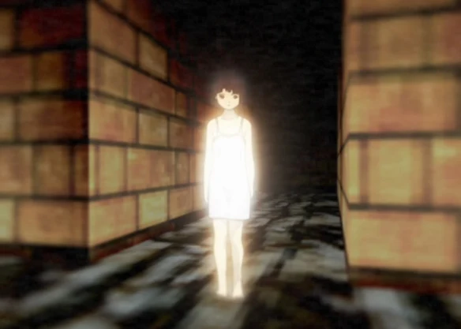
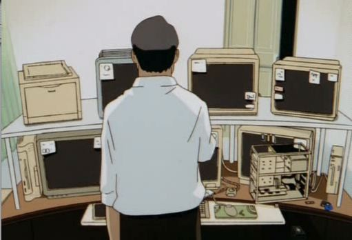
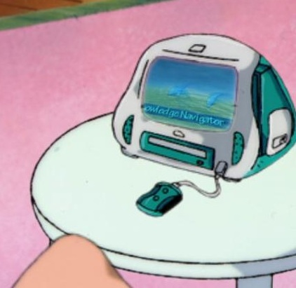
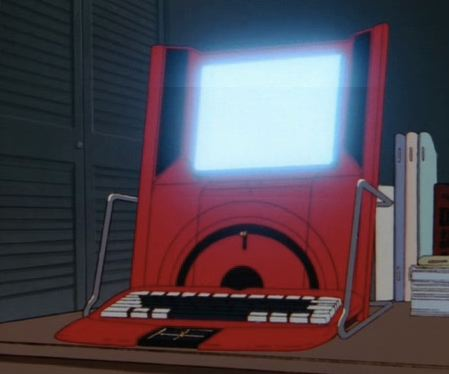
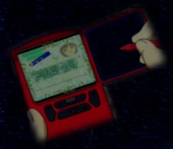
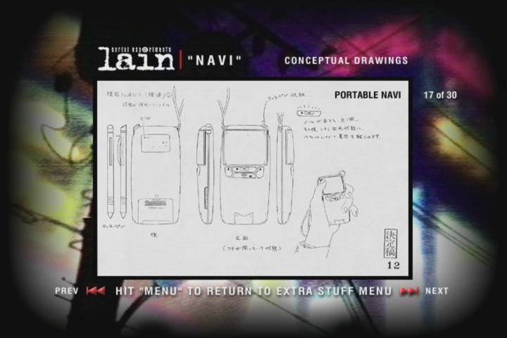

# مقدمة
>ملحوظة: هذه المقالة لا تعني بالضرورة تشجيعي لك على متابعة هذا الأنمي وإنما فقط استعراض لبعض المعلومات فيه وفيها  حرق كبير للأحداث

السلام عليكم ورحمة الله وبركاته وأهلا بكم في مقالة عامة جديدة سيكون كلامنا اليوم عن أنمي [Serial Experiments Lain](https://en.wikipedia.org/wiki/Serial_Experiments_Lain) وكيف أنه وفي مرحلة مبكرة جدا استطاع أن يتنبأ بما سيكون عليه شكل الانترنت الحالي مع توقعات كثيرة لطريقة تفاعل العالم معه. هذا وقد صدر الأنمي في عام 1998 أي أنه صدر في مرحلة مبكرة للغاية من صدور الانترنت والكمبيوترات ومع ذلك كان لديه توقعات دقيقة جدا عن كيف سيعيش عالمنا مع وجود الانترنت سنستعرض معظمها في هذه المقالة

# الخيال العلمي في حبكة الأنمي
من المثير للاهتمام أن الخيال العلمي في القصة لم يكن جانحا كأغلب الكتابات في تلك الفترة واكتفى فقط بتصوير القصة من المستقبل القريب حيث لم يحدث تطور كبير في العالم عن 1998 فقط دخل الانترنت بشكل قوي في الاتصالات وأصبح بأيدي العامة ولا ننكر أن الأنمي ذهب بعيدا في بعض الأشياء كالتلاعب بالذاكرة والواقع ونقل الوعي لكن كلها تم تصويرها على أنها تقنيات سرية أو محظورة. على الأقل لم يصورنا على أننا اخترعنا عربات طائرة أو أن الروبوتات أصبحت تخدمنا في كل شيء وهذا ما يجعل بصيرة الكتاب قوية بحق.

# الهاكرز وجماعة الفرسان
جماعة الفرسان في القصة هي مجموعة من الأشخاص مجهولي الهوية داخل العالم الافتراضي ذوي معرفة تقنية عالية مكنتهم من فرض سيطرتهم على العالم الافتراضي ويحاولون صهر الحواجز بين العالم الافتراضي والواقعي للتحكم به أيضا. وفي سبيل ذلك ظهرت معظم التقنيات السرية في الأنمي. والمثير للاهتمام أن أوصافهم تنطبق على الهاكرز بشكل كبير حتى أنه تم مناداتهم بالهاكرز أحيانا في الأنمي ونظرا للفترة المبكرة للأنمي فهذا تكهن قوي جدا. حتى تم تصوير بعض الآثار القوية التي خلفتها اختراقاتهم للبنية التحتية للاتصالات مما يدل على تزايد خطر الهاكرز كل ما زادت أهمية الانترنت في حياتنا وهذا بحق تصوير ذكي لعالمنا الحالي.

# فانتوما وألعاب الأونلاين
فانتوما هي لعبة قتل جماعية يلعبها الأطفال داخل العالم الافتراضي ولكن بسبب تقنيات الفرسان المبنية على تجارب ال"كيدز" كل من يموت في اللعبة يقتل في أرض الواقع. وما شدني في الأمر أن ألعاب الأونلاين لم تكن موجودة في فترة صدور الأنمي فقدرة الأنمي على تصور أن الإنترنت سيكون قادرا على وصل اللاعبين مع بعضهم في الشبكة والقدرة على اللعب الجماعي في نفس الوقت تنبأ ذكي.

# الإنترنت والانفصال عن الواقع
تم تصوير الانفصال عن الواقع واللجوء للانترنت للهروب منه في القصة بصور عديدة فتم تصوير الصداقات الالكترونية والانعزال والانكباب على الحواسيب وتم تصويره أيضا بطريقة فلسفية وهي حالة التخلي عن الجسد المادي ونقل الوعي للعيش في العالم الافتراضي طارحا العديد من الأسئلة عن الشكل الذي ستؤول إليه العلاقات بين البشر وتأثير الانترنت عليها.
# تعدد الشخصيات بين الإنترنت والواقع
في الأنمي تم تصوير بطلة الأنمي لاين على أن لديها شخصيتين مستقلتين: شخصيتها الواقعية وهي فتاة خجولة، ووحيدة، وغريبة الأطوار أحيانا، ومترددة  --وشخصيتها في العالم الافتراضي وهي فتاة شجاعة، وحازمة، وذات شخصية قيادية، ونضج في التصرفات (أحيانا تخرج هذه الشخصة في العالم الحقيقي في حالات الخطر)  وأيضا يمكنك أن ترى انفصالا في شخصيات أعضاء الفرسان إذ أنهم في العالم الافتراضي من أعتى المجرمين وأذكاهم وفي الواقع هم عبارة عن:
1. ربة منزل
2. رجل فاشل لا يخرج من بيته
3. مدير شركة
4. طفل في سن المدرسة

الأمر شبيه للغاية للحالة التي يعيشها الكثيرون في حياتنا الحالية إذ نميل لأظهار جوانب في شخصيتنا في الإنترنت نخجل من إظهارها في الواقع لأحساسنا بالأمان هناك.

# أشكال الحواسيب في عالم القصة
لو تأملت الحواسيب أو "النافي" في عالم القصة فبالرغم من بعض القصور في تصميمها نظرا لفترة إنتاج الأنمي لا زالت تحمل دقة عالية في التوقع كتخيلهم للحواسيب المحمولة (اللابتوب)
 والهواتف الذكية  
 وبعض التصاميم الغريبة كحاسوب محمول على شكل مسدس. معتمدين على التصور القائل بأن كل ما تطورت 
 التقنية كل ما صار للأجهزة القدرة على حمل آداء أعلى بحجم أقل وكان اإنتاج الإنمي في فترة قريبة من وصول الأجهزة المحمولة وهذا أدى لتصاميم جدا دقيقة في التصور.
 
# شبكة زانادو
هذا ليس تنبأً وإنما لفتة لطيفة تدل على الثقافة التقنية الواسعة للمؤلف لإشارته لمشروع زانادو [project Xanadu ](https://en.wikipedia.org/wiki/Project_Xanadu)  داخل قصة الأنمي ولمن لا يعرفه فقد كان هو المشروع المقرر أن يكون الشبكة العالمية وقد جاء معه [نظام النص التشعبي](https://en.wikipedia.org/wiki/Hypertext) وقد لاقا استحسانا واسعا قبل الانترنت لكنه بطبيعة الحال تم نسيانه وتجاهله بسبب التزام المطور بالمثالية وعدم الثبات على فكرة معينة ليصبح المشروع فكرة مثالية على الورق دون أي تطبيق عملي. المضحك في الأمر هو الاستهجان الدائم للقائمين على المشروع للإنترنت بوصفه تقليدا رخيصا لزانادو مع أن مشروعهم تم بدأ العمل عليه من قبل الانترنت ولا زال قائما للآن دون نتيجة ملموسة.
